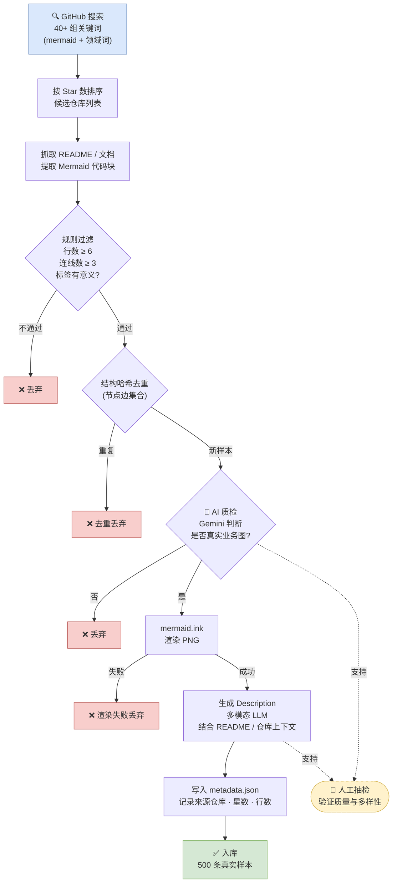
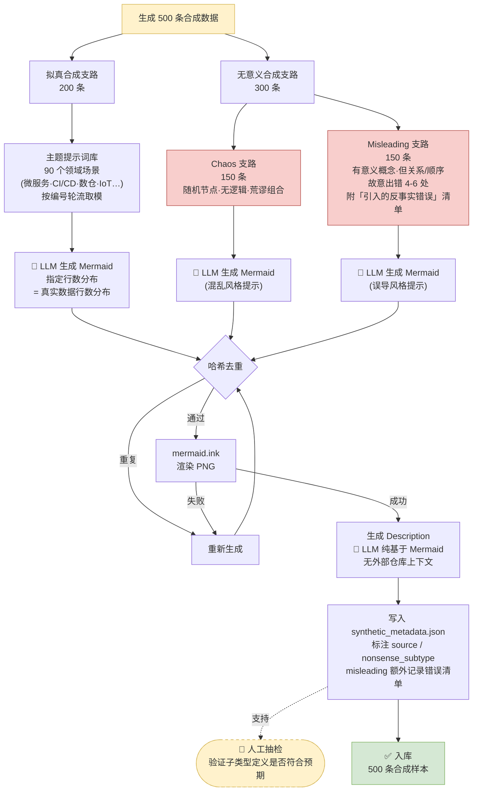
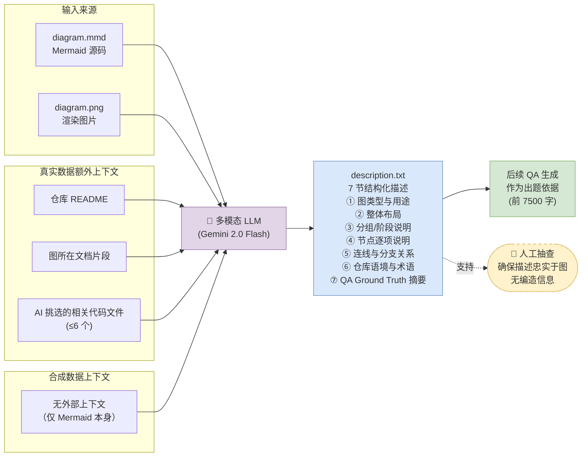
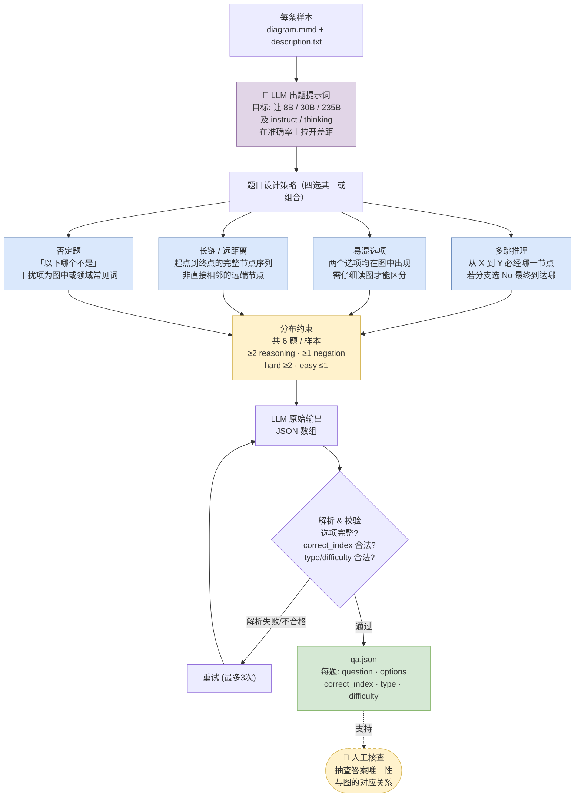
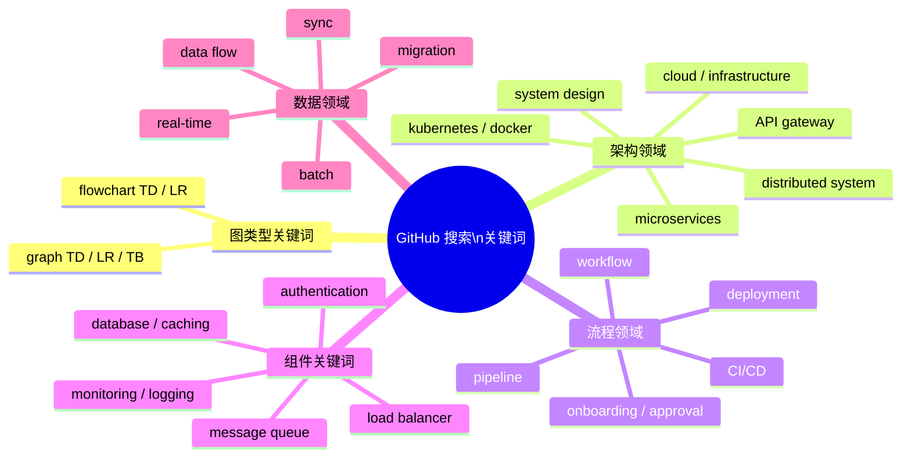
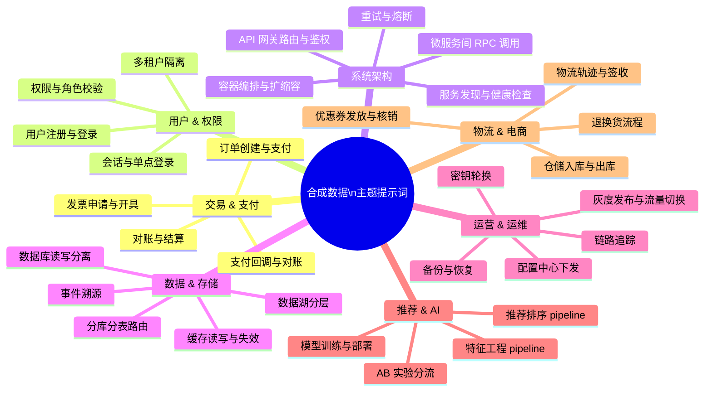

# FlowSight Dataset — 论文配图（Mermaid 源码）

本文件收录用于论文写作的所有流程图 / 结构图的 Mermaid 源码。
渲染时直接复制对应代码块到 [mermaid.live](https://mermaid.live) 或 Obsidian / Typora 预览即可。

---

## Fig 1 · 数据集整体结构

> 读者第一眼看到的总览图。强调三大来源（真实 / 拟真合成 / 无意义合成）及其在数据集中的比例与作用，同时标注每条样本的统一"三件套"格式。

```mermaid
graph TD
    DS[("FlowSight Dataset\n1 000 条")]

    DS --> REAL["🗂 真实数据\n500 条\n来自 GitHub 开源项目"]
    DS --> SYN["🤖 合成数据\n500 条\nLLM 生成"]

    SYN --> MEAN["拟真合成\n200 条\n逻辑合理·术语正常"]
    SYN --> NONE["无意义合成\n300 条\n用于探测"看图"能力"]

    NONE --> CHAOS["Chaos（完全混乱）\n150 条\n随机节点·荒谬组合\n常识无法帮助作答"]
    NONE --> MISLED["Misleading（误导）\n150 条\n有真实对应但故意组合错误\n常识反而会误导"]

    REAL --> ITEM["每条样本\ndiagram.mmd\ndiagram.png\ndescription.txt"]
    MEAN --> ITEM
    CHAOS --> ITEM
    MISLED --> ITEM

    ITEM --> QA["qa.json\n6 道单选题\nfactual / reasoning / negation\neasy / medium / hard"]

    style DS fill:#f0f4ff,stroke:#6c8ebf,stroke-width:2px
    style REAL fill:#d5e8d4,stroke:#82b366
    style SYN fill:#fff2cc,stroke:#d6b656
    style MEAN fill:#ffe6cc,stroke:#d79b00
    style NONE fill:#f8cecc,stroke:#b85450
    style CHAOS fill:#f8cecc,stroke:#b85450
    style MISLED fill:#f8cecc,stroke:#b85450
    style ITEM fill:#dae8fc,stroke:#6c8ebf
    style QA fill:#e1d5e7,stroke:#9673a6
```

---

## Fig 2 · 真实数据采集与标注工作流

> 以"搜索词驱动"为入口，展示从 GitHub 检索到最终一条样本入库的完整路径。两层过滤（规则 + AI 质检）和渲染失败的丢弃路径要清楚。人工审查以侧注方式标注。



---

## Fig 3 · 合成数据生成工作流

> 两条并行支路（拟真 vs 无意义），共用"LLM 生成 → 渲染 → Description"的骨架。重点体现：拟真用主题提示词驱动；无意义分 chaos / misleading 两种不同的提示策略；哈希去重防止雷同。



---

## Fig 4 · Description 生成工作流

> 真实图和合成图在 Description 生成上有不同的上下文来源。这张图专门拆开这两条路径，展示 LLM 如何综合多源信息生成 7 节结构化描述，以及描述在后续 QA 生成中的作用。



---

## Fig 5 · QA 生成工作流

> 强调"能拉开模型差距"是题目设计的核心目标；展示四种题目设计策略的并列关系；以及题目类型 / 难度标注的分布约束。



---

## Fig 6 · QA 题型与难度分类体系

> 这张图适合放在"评测设计"小节前，用来解释 factual / reasoning / negation 三类题型的认知操作差异，以及 easy / medium / hard 的区分标准。矩阵式布局比纯文字表格更直观。

```mermaid
graph LR
    subgraph TYPE ["题目类型 — 认知操作轴"]
        F["Factual（事实）\n单步提取\n答案在图中直接可见\n测: 是否真的看图"]
        R["Reasoning（推理）\n多步推理\n整合多节点/路径关系\n测: 结构理解与推理链"]
        N["Negation（否定）\n排除判断\n理解「不是」并抑制常识\n测: 完整理解+抵抗干扰"]
    end

    subgraph DIFF ["题目难度 — 所需步数轴"]
        E["Easy\n单步·答案明显可见\n大多数模型能答对\n保证基线"]
        M["Medium\n看图+简单推理\n顺序·相邻节点关系\n区分\"表面\"与\"会推一步\""]
        H["Hard\n多步/长链/易混/否定\n非相邻节点·两个选项都在图中\n拉开参数量与模型形态差距"]
    end

    F --- E
    F --- M
    R --- M
    R --- H
    N --- M
    N --- H

    style F fill:#dae8fc,stroke:#6c8ebf
    style R fill:#dae8fc,stroke:#6c8ebf
    style N fill:#dae8fc,stroke:#6c8ebf
    style E fill:#d5e8d4,stroke:#82b366
    style M fill:#fff2cc,stroke:#d6b656
    style H fill:#f8cecc,stroke:#b85450
```

---

## Fig 7 · 搜索关键词与合成主题词全景（词云替代方案）

> Mermaid 本身不支持词云。这里用两个并列的 mindmap（思维导图）替代：一个展示爬取真实数据用到的主要关键词分类；一个展示 LLM 生成拟真数据用到的主题词分类。如需真正的词云，用 Python wordcloud 库另行生成。

### 7A · GitHub 搜索关键词（真实数据）



### 7B · LLM 生成拟真合成数据主题词



---

## 附注

- **人工审查** 在所有流程图中以**虚线框**标注，代表"支持性质检"而非强制节点，实际执行为抽样核查。
- **词云（Fig 7）** 的 Mermaid mindmap 版本适合论文/报告渲染；如需投稿到图片要求严格的期刊，建议用 Python `wordcloud` 库另外生成真实词云图，两者可互补。
- 所有流程图均已在 [mermaid.live](https://mermaid.live) 验证可渲染。
